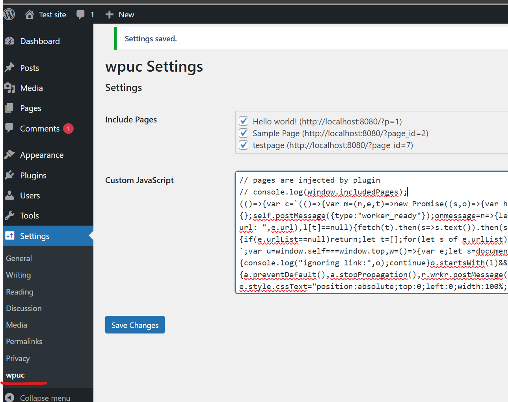

## wpuc

Clone the repository and navigate to a folder root, install npm dependencies
> npm i 

Build the dist file
> npm run build

Currently only the 

Add the script from the dist folder inside your wp site's head tags and you are good to go.

wpuc.php is a wp-plugin and can be added to wp-content/plugins folder

After that activate it, and the its accessible from the setup menu:

